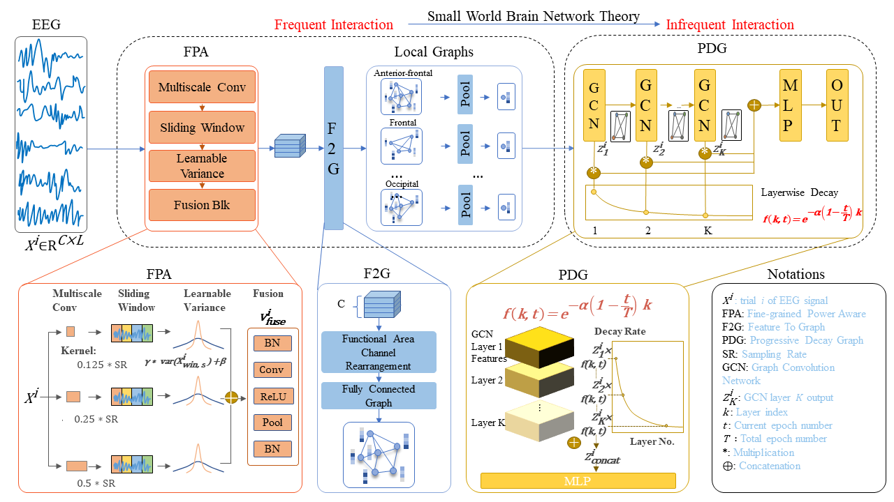

# SHINE — Small-world Hierarchical Interconnected Graph Neural Network

Reference implementation for **SHINE**, a graph neural network for EEG-based
classification of attempted hand opening / closing in healthy subjects and
post-stroke patients.

> Lin, X. *et al.*, "Neuroscience-Inspired Hierarchical GNN for Grasping
> Attempt Classification" (under review, 2026).

## Architecture



SHINE jointly models *frequent* intra-region and *infrequent* inter-region EEG
dynamics:

| Module | Role | Code |
|---|---|---|
| **FPA** — Fine-grained Power-Aware | multiscale temporal conv + sliding window + learnable variance + fusion | `models/SHINE.py`: `LearnableVarianceWindow`, `LearnableVariance`, `_make_fpa_branch`, `fusion_block` |
| **F2G** — Feature-to-Graph | reorder 61 EEG channels into 8 functional regions, each a fully-connected local graph | `models/SHINE.py`: channel reorder in `forward`; region table in `model_configs/SHINE.py: _functional_regions` |
| **Local Graphs** | learnable per-channel weighting + ReLU + region-mean pooling → one node per region | `models/SHINE.py`: `_local_graph_filter`, `RegionAggregator` |
| **PDG** — Progressive Decay Graph | stacked GCN layers with a layer-wise decay function `f(k, t) = exp(−α(1−t/T)k)` that progressively weakens long-range connections | `models/SHINE.py`: `GCNLayer`, `pdg_layers`, `_layerwise_decay`, `_compute_region_adjacency` |
| **Classifier** | dropout + linear, binary output | `models/SHINE.py`: `classifier` |

Hyperparameters use the manuscript notation: `alpha` (α), `num_gcn_layers` (K),
`region_dim` (d), `window_size_samples` (q), `variance_window_ms` (w),
`window_stride_ratio`, `variance_stride_ratio`.

## Installation

Requires CUDA 11.6 (or compatible) and `conda`.

```bash
conda env create -f environment.yml
conda activate shine
```

## Quick start

```bash
# default: 1 subject, open-vs-rest, SHINE with manuscript defaults
python main.py

# all 19 subjects, close-vs-rest task
python main.py start=0 end=19 dataset=patients_rest_close_ica

# override hyperparameters via Hydra
python main.py model.alpha=0.3 model.num_gcn_layers=3 model.region_dim=64

# pin a specific GPU
python main.py device=0

# short smoke test (1 epoch, 1 subject)
python main.py epochs=1 end=1
```

`python main.py --cfg job` prints the resolved Hydra config without launching
training.


## Data layout

The training script expects each dataset at `../datasets/<dataset_name>/`
(relative to the repo root), with one EEG file and one labels file per
subject:

```
../datasets/patients_rest_open_ica/
  s000.npy           # subject 0 EEG, shape (n_trials, 1, 61, 1000)
  y000.npy           # subject 0 labels, shape (n_trials,)
  s001.npy
  y001.npy
  ...
  s018.npy           # 19 subjects total
  y018.npy
```

Each EEG file has shape `(n_trials, in_channels=1, n_eeg_channels=61, n_timesteps=1000)`
sampled at 250 Hz. Labels are integers in `{0, 1}` (rest vs. attempted
opening / closing).

Datasets shipped with the configs:

| Dataset name (Hydra) | Task |
|---|---|
| `patients_rest_open_ica` | post-stroke, attempted hand opening vs. rest |
| `patients_rest_close_ica` | post-stroke, attempted hand closing vs. rest |


## Output

Each run creates `./results/<folder_name>/` with:

```
results/SHINE_n_fold_cross_validation_10_patients_rest_open_ica/
  model_weights/      checkpoints, one per (subject, fold)
  acc_and_loss/       per-epoch train/val/test arrays as .npy
  loss_curves/        loss/accuracy curve PNGs
  exp_data/           per-subject result CSVs
  logger/             plain-text training log
```

Folder names embed the model + training method + nfolds + dataset, with any
overridden hyperparameters appended.

## Repository layout

```
configs/                 # Hydra config tree (model / dataset / trainer / optimizer / config)
docs/                    # manuscript figures
model_configs/SHINE.py   # SHINE Configs class — full hyperparameter schedule
models/SHINE.py          # SHINE model — FPA + F2G + LocalGraphs + PDG + Classifier
trainers/                # subject-dependent CV orchestrator + per-fold training loop
utils/                   # helpers (parser_args, plotting, metrics, seeding)
main.py                  # Hydra entry point — fixed at n_fold_cross_validation
environment.yml          # conda environment spec
```

## Citation

```bibtex
@article{lin2026shine,
  title   = {Neuroscience-Inspired Hierarchical GNN for Grasping Attempt
             Classification},
  author  = {Lin, Xiaohao and Wang, Yucheng and Ding, Yi and Zhang, Shuailei
             and Chen, Zhenghua and Wu, Min and Jiang, Muyun and Thomas,
             Kavitha and Robinson, Neethu and Ng, Han Wei and Khendry, Nishka
             and Wai, Aung Aung Phyo and Xiao, Wenjin and Kuah, Christopher
             Wee Keong and Wee, Seng Kwee and Chua, Karen Sui Geok and Guan,
             Cuntai},
  journal = {Under Review},
  year    = {2026},
}
```
